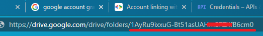

# Auto-Gen-SQLBackUpScript

## Getting started
- Create folder with venv
```
mkdir test
virtualenv -python=python3.6 venv
source venv/bin/activate
```
- Install requirement
```
pip install mssql-scripter
pip install PyDrive
```
- Change path to venv in gen_script_sql.sh at 3 lines:
```
source /home/may3/Desktop/ETL/etl-demo/venv/bin/activate
mssql-scripter -S $InstanceName -d $val -U sa -P 123456a@ --display-progress --schema-and-data -f /home/may3/Desktop/ETL/etl-demo/$val$CURRENTFILENAME.sql
echo "$val$CURRENTFILENAME.sql" >> /home/may3/Desktop/ETL/etl-demo/log.txt
```
- Setting Google Drive API and auth for Google account: https://docs.google.com/document/d/1oGsZ3SX2wngLVelv1kNCXbgQqNqodZD0M7gL80aKZfQ/edit?usp=sharing

- After download json auth file, create settings.yaml
```
client_config_backend: settings
client_config:
  client_id: "YOUR_CLIENT_ID"
  client_secret: "YOUR_CLIENT_SECRET"
save_credentials: True
save_credentials_backend: file
save_credentials_file: credentials.json
get_refresh_token: True
oauth_scope:
  - https://www.googleapis.com/auth/drive.file
```

- Update targetDirID in drive_upload.py. TargetDirId like this 
```
targetDirID = ""
```

## Times to run
- For more detail option
```
./gen_script_sql.sh -h 
```
- Example run
```
./gen_script_sql.sh -i 127.0.0.1 -d dbName1,dbName2,dbName3
```

## License
For open source projects, say how it is licensed.
